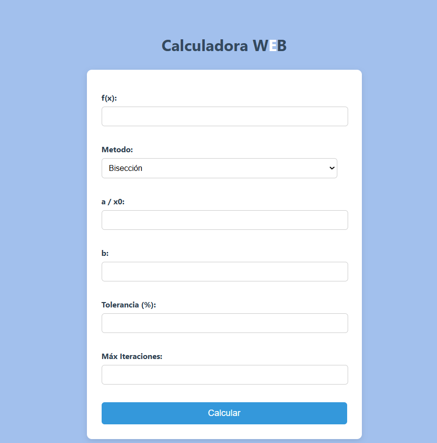
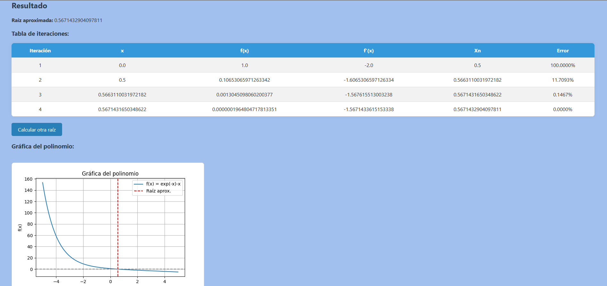

#  Calculadora Web 

Esta es una aplicación web desarrollada con Django,Python,HTML,CSS que permite calcular raíces de funciones matemáticas utilizando tres métodos numéricos:

- Método de Bisección
- Método de Newton-Raphson
- Método de Newton-Raphson Modificado

También muestra una tabla de iteraciones con los errores y una gráfica de la función ingresada.

## Características

- Entrada de funciones simbólicas en términos de `x`.
- Soporte para visualizar gráficamente la función.
- Reporte detallado de las iteraciones con errores en porcentaje.

---
## Ingreso de datos
Para utilizar correctamente la calculadora, se deben seguir los siguientes parámetros:

Permitido:

- Usa x como variable.
- Escribe potencias con ** (doble asterisco):

Ejemplo: 

x**2 + 3*x – 5

Puedes usar operadores matemáticos comunes:

- Suma: +
- Resta: -
- Multiplicación: *
- División: /
  
Puedes usar funciones matemáticas:
- sin(x), cos(x), tan(x)
- log(x) para logaritmo natural
- sqrt(x) para raíz cuadrada
- exp(x) para exponencial

No utilizar:

- Escribir x^2 (usa x**2 en su lugar).
- Dejar espacios no necesarios.
- Usar mayúsculas en funciones (Sin(x) esto es incorrecto).
- Ingresar letras distintas de x como variables.
  
Ejemplos válidos:

- x**3 - 4*x + 1
- sin(x) + x**2
- log(x) - x/2
- exp(x) - 3

## Vista Principal

## Vista Ventana de Resultados

## Requisitos

- Python 3.8 o superior
- Django 4.x
- SymPy
- Matplotlib

